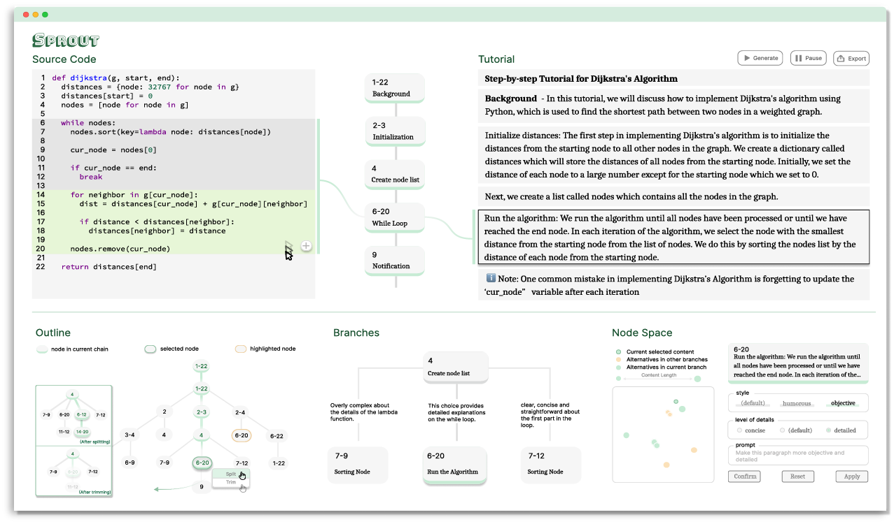
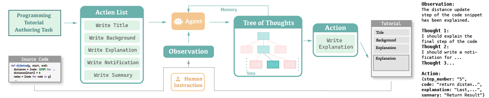

# SPROUT: Authoring Programming Tutorials with Interactive Visualization of Large Language Model Generation Process

Here is the official implementation of the system in paper ["SPROUT: Authoring Programming Tutorials with Interactive Visualization of Large Language Model Generation Process"](https://arxiv.org/abs/2312.01801).



> ℹ️ **NOTE**: SPROUT is currently developed as a research prototype and may be unstable, containing bugs. However, we are actively working on improving its stability and functionality.

## Description

SPROUT is an interactive system that utilizes novel prompting strategies and interactive visualizations to facilitate the step-by-step generation of programming tutorials with LLMs.

### Architecture



We break down the programming tutorial creation task into actionable steps which are provided as initial system prompts to the agent. During the generation process, the agent receives the source code and user instructions, generating multiple potential thoughts based on its memory and the observation derived from the source code and current tutorial content. Then it takes the proper action and plans for subsequent steps.The iterative process continues until the tutorial is complete.

### Features

SPROUT offers series of features that are designed for enhancing user experience in the process of tutorial authoring :

- **Content Generation from Code Snippets**: SPROUT supports two interactions that enable the generation of diverse and user-customized content from the source code provided by users.
- **Tutorial Modification through Tree Graph**: SPROUT enables users to utilize the tree graph as the primary controller for flexible and intuitive modification of the tutorial content through manipulating the nodes within the tree.
- **Context Switch across Branches**: To facilitate a more diverse and flexible organization of the tutorial's content, SPROUT provides two interactions to assemble paragraphs and switch between various contexts generated by LLMs flexibly.
- **Detail Refinement in Node Space**: SPROUT implements two-part interactions, providing users with a systematic approach to refine the content and achieve the desired outcome.
- **Visualization for Tutorial Understanding**: To strike a balance between clearly separating two kinds of media resources (i.e., code and text) and offering visual elements of their connections, SPROUT designs visual representations for users to understand what the text block is about and where it comes from.

## Citation

```
@article{
  author       = {Yihan Liu and
                  Zhen Wen and
                  Luoxuan Weng and
                  Ollie Woodman and
                  Yi Yang and
                  Wei Chen},
  title        = {{SPROUT:} Authoring Programming Tutorials with Interactive Visualization
                  of Large Language Model Generation Process},
  journal      = {CoRR},
  volume       = {abs/2312.01801},
  year         = {2023},
  url          = {https://doi.org/10.48550/arXiv.2312.01801},
  doi          = {10.48550/ARXIV.2312.01801},
  eprinttype    = {arXiv},
  eprint       = {2312.01801},
}
```

## Development

To develop SPROUT locally, follow these steps:

1. Install all the dependencies.

```bash
npm install
```

2. Create an `.env` file at the project ROOT, where you need to put the OpenAI API key. The file should look like:

```
NEXT_PUBLIC_OPENAI_API_KEY = ""
```

3. Start the local server.

```bash
npm run dev
```
